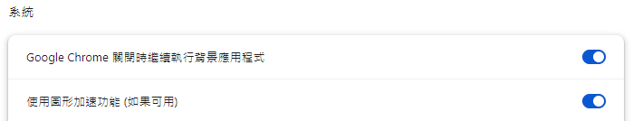
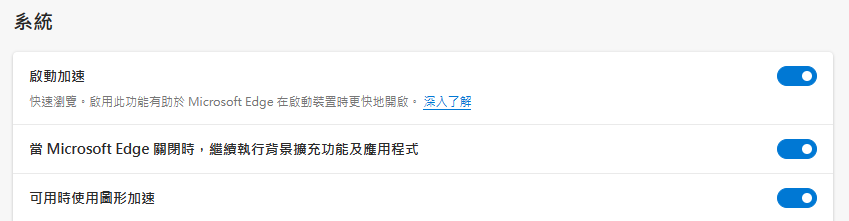

# csci4140_proj_weather_app

2024 CSCI4140 project

# Render Cloud link

https://csci4140-proj-weather-app.onrender.com

# Important Notes

Please 

1. Ensure your computer have GPU support and and turn it on browser 

    
    

2. If run in localhost/docker, please update axios baseURL
   currently it's using Render URL for deployment on Render  
   /app/src/help/http.ts

# Run the Application

1. cd server
2. pip install -r requirements.txt
3. python server.py
4. access http://127.0.0.1:8088/

### if run in docker

1. docker-compose up --build
2. access http://127.0.0.1:5173/

# if updated /app folder

1. cd app
2. npm run build-only
3. move the dist folder from /app to /server
4. reboot the application

# Folder struture

- app (vue)  
  - src
    - asset (store resource file like 3d model / image)
    * component (vue components)
      - Canvas (3D scene)
        - index.vue (render 2d plane, user-controlled model and weather )
        * Weather
          - Cloud.vue (render the cloud model, use interval to animate)
          - Humidity.vue (render fog effect)
          - Rainfall.vue (render raining animation)
          - Sun.vue (render a sun model and provide a light source)
          - UVRay.vue (render a pink/purple color light source)
          - Wind.vue (render windmill model and display data by animation speed)
      - Panel (User Control UI)
        - index.vue (render 3 buttons and a side panel)
        - Options (logic of 3 button)
    * helper (axios and emitter)
    * hooks (part of the logic of components)
    * router
    * store (a global data storage across component)
    * types (typescript type)
    * App.vue
    * constant.ts (store location coordinate)
    * main.ts (dependency import)
  - other are mainly default config file
- server(flask server) 
  - data (all the weather data stored in csv)
  - dist (the production folder of vue, serve directly in flask)
  - server.py (server entry)

# ['W','A','S','D'] for controlling model
